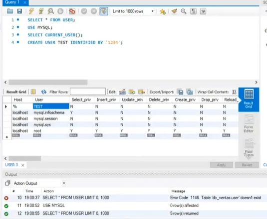

# UD6

## Resumen de la Unidad (En palabras simples)

---

- esta unidad trata sobre cómo mantener tu base de datos segura y rápida. Se divide en dos grandes bloques:Seguridad (Usuarios, Privilegios y Roles): Se trata de controlar exactamente quién tiene la llave para entrar a la base de datos y, una vez dentro, qué cosas específicas puede tocar o mirar. Para no ir uno por uno, puedes crear "Roles" (como un pase VIP o un pase de empleado normal) y dárselos a varios usuarios a la vez.Rendimiento (Índices): Se trata de enseñar a la base de datos a buscar información rápido. Funciona exactamente igual que el índice de un libro: en lugar de leer todas las páginas para buscar un tema, vas al índice, ves la página exacta y saltas directo a ella.

---

### CREAR

1. Usuarios - crear, modificar y eliminar cuentas de acceso( `CREATE USER`, ÀLTER USER`,`DROMP USER`).
2. Privilegios y Roles - Controlar que puede hacer cada usuario (`GRANT`, `REVOKE`, `FLUSH`, `PRIVILEGES`), Y agrupar permisos en roles para facilitar la gestion.
3. indices - Estructuras que aceleran las consultas ( `CREATE INDEX`, `DROP INDEX`, tipos de indices).

Ejemplos : 

    CREATE USER 'ana' @ 'localhots' IDENTIFIED BY 'pass123'
    CREATE USER 'remoto'@'%' IDENTIFIED BY 'pass456'
    CREATE USER 'backup'@'192.168.1.%' IDENTIFIED BY 'bk789'

`localhost`= solo local | `%` = cualquier IP | `192.168.1.1% ` = red especifica. 

### Ver | Modificar | Eliminar

     --- Ver todos los usuarios 

    SELECT User, Host FROM mysql.user;

     --- cambiar contraseña
    
    ALTER USER 'ana'@'localhost' IDENTIFIED BY 'NuevoPass!';

     --- Forzar cambio en proximo login 

    ALTER USER 'ana'@'localhost' PASSWORD EXPIRE;

     --- Eliminar usuario

    DROP USER 'remoto'@'%';

## PRIVILEGIOS Y ROLES

### GRANT /REVOKE (Asignar y revocar privilegios)

    --- Todos los privilegios sobre una base de datos.

    GRANT ALL PRIVILEGES ON ventas.* TO 'ana'@'localhost';

    --- Solo lectura en una tabla

    GRANT SELECT ON ventas.pedidos TO 'user1'@'%';

    --- Ver privilegios de un usuario

    SHOW GRANTS FOR 'ana'@'localhost';

    --- Revocar permisos

 REVOKE INSERT, UPDATE ON ventas.*FROM 'user1'@'%';

    --- Aplicar cambios

    FLUSH PRIVILEGES;

### ROLES

Los roles agrupan privilegios para asignarlos a varios usuarios a la vez
    --- 1. Crear el rol

    CREATE ROLE 'gestor_ventas';

    --- 2. Dar privilegios al rol

    GRANT SELECT, INSERT, UPDATE ON ventas.* TO 'gestor_ventas';

    --- 3. Asignar rol al usuario

    GRANT 'gestor_ventas' TO 'user1'@'localhost';

    --- 4. Activar rol automaticamente al iniciar sesión 

    SET DEFAULT ROLE 'gestor_ventas' TO 'user1'@'localhost';

Diferencia clave: GRANT asigna el rol pero no lo activa automaticamente. SET DEFAOULT ROLE hace que se active en cada inicio de sesión.

Indice en MySQL

¿Que son?
Los indices aceleran las busquedas como el indice de un libro. Sin indice, MySQL lee la tabla entera(full scan).

* Simple- una sola comuna 
* Compuesto- varias columnas 
* UNIQUE- no permite duplicados
* FULLTEXT- busquedas en texto largo

 **Sintaxis**

 ## crear | ver | eliminar

    --- indice simple
    
    CREATE INDEX idx_nombre ON clientes (nombre);

    --- Indice compuesto

    CREATE INDEX idx_nom_ape ON clientes (nombre, apellido);

    --- Indice único

    CREATE UNIQUE INDEX idx_email ON clientes (email);

    --- Ver indices de una tabla

    SHOW INDEX FROM clientes;

    --- Eliminar indice

    DROP INDEX idx_nombre ON clientes;

consejo: Los indices mejoran con SELECT Y JOIN, pero INSERT/UPDATE/DALETE porque hay que actualizarlos. 

--NOTA ANTES DE SHOW GRANTS , AGREGAR PERMISOS CON FLUSH.

 --- se puede agregar mas de un privilegio a la vez.

GRANT INSERT, UPDATE, DELETE, SELECT ON base_datos.* USUARIO@LOCAL;  para aplicar varias ACORDARSE DE LAS COMAS Y PARA QUE SIRVE CADA PRIVILEGIOS. 

--- para quitar un privilegio, usamos la palabra revoke + el nombre del privilegio a quitar + on + base_De_datos(aquitar)+ objeto de los cuales aplica el objeto. +from+ NOMBRE DEL USUARIO. 

ejemplo:

 REVOKE INSERT ON bd_ventas.* FROM usr_ventas@localhost;

tambien usamos flush privileges para verificar que los cmbios fueron utilizados. 

para ver el usuario root en la cual accedemos a nuestra base de datos. usamos el `SELECT CURRENT_USER();`
nos mostrara el usuario root  

forma mas simple de crear usuario de base de datos. 
 
cuando crees el usuario nuevo con la contraseña asegurar de cambiar el `USE`a MYSQL. como lo indica la imagen. 

luego al usuario tambien lo podemos crear con "@" con la IP de la conmputadora desde la cual se conectara al usuario. 

`SELECT * FROM USER;` lista aparecera la IP puesta 

para bloquear al usuario:

ALTER USER test@localhost ACCOUNT LOCK; --> UNLOCK ---> deblouqea al usuario. 