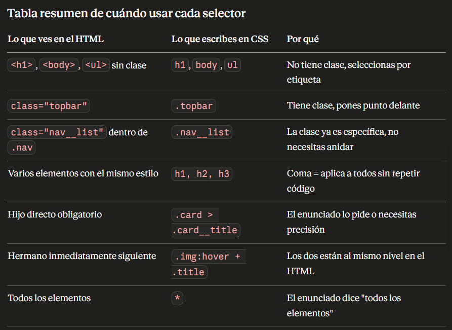

# ud4 css

**Cuándo usas etiqueta, cuándo clase, cuándo id**
Etiqueta `(h1, body, ul, li)` — la usas cuando quieres afectar a ese tipo de elemento en toda la página, sin importar dónde esté.

ejemplo de clase:
**Clase** (.topbar, .card) — la usas cuando el HTML ya tiene un class="..." en ese elemento. La clase te permite ser específico: no afectas a todos los <ul> de la página, solo al que tiene esa clase.
**Id** (#mi-id) — igual que la clase pero solo puede usarse una vez en toda la página. En exámenes de CSS rara vez lo pedirán para estilos, más para JavaScript.
**La regla práctica:** mira el HTML. Si el elemento tiene class="algo" y quieres afectar solo a ese, usas .algo. Si quieres afectar a todos los h1 de la página sin importar dónde estén, usas h1 directamente.

## BLOQUE 1

```css
/* El * es el selector universal. Significa "todos los elementos sin excepción".
   El enunciado dice "quitar márgenes y padding a todos los elementos".
   No hay clase ni etiqueta específica, quiere TODOS. Por eso usas *. */
* {
    margin: 0;
    padding: 0;
    /* Los navegadores (Chrome, Firefox) añaden márgenes propios por defecto.
       Por ejemplo, el body tiene 8px de margen. Este * los elimina todos. */

    box-sizing: border-box;
    /* Por defecto en CSS, si un elemento mide 300px y le pones padding: 20px,
       en realidad mide 340px. Con border-box le dices que el padding
       se cuenta DENTRO de los 300px, no por encima. */
}

/* body es una etiqueta, no tiene clase en el HTML.
   El enunciado pide tipografía para el cuerpo, fondo y color de texto.
   Como es algo global para toda la página, vas directo a la etiqueta body. */
body {
    font-family: Arial, sans-serif;
    /* Puedes poner varias fuentes separadas por coma. El navegador prueba
       la primera, si no la tiene prueba la segunda. Arial primero,
       si no existe, cualquier sans-serif del sistema. */
    background-color: #f5f5f5;
    color: #333;
}

/* El enunciado pide tipografía DISTINTA para los títulos.
   Distinta del body, que tiene Arial. Los títulos tendrán Georgia.
   h1, h2, h3 no tienen clase en el HTML. Los seleccionas por etiqueta.
   Son tres etiquetas con el mismo estilo, por eso agrupas con coma. */
h1, h2, h3 {
    font-family: Georgia, serif;
}

/* .wrap es la clase del <main class="wrap"> en el HTML.
   El enunciado dice "limitar el ancho máximo" y "centrar el contenido".
   Como solo quieres afectar a ese contenedor específico, usas la clase. */
.wrap {
    max-width: 1200px;
    /* max-width no fija el ancho, solo pone un límite.
       Si la pantalla es de 800px, el elemento mide 800px.
       Si la pantalla es de 1400px, el elemento mide como máximo 1200px. */

    margin: 0 auto;
    /* margin con dos valores: el primero es arriba/abajo, el segundo izq/dcha.
       0 arriba y abajo. auto a los lados.
       auto en los lados significa "reparte el espacio sobrante por igual a cada lado".
       Eso es lo que centra el contenido. Solo funciona si hay max-width definido. */

    padding: 0 1rem;
    /* Igual que margin: 0 arriba/abajo, 1rem a los lados.
       Esto añade separación interior lateral para que el contenido
       no toque el borde de la pantalla. */
}
```

## BLOQUE 2

BLOQUE 2 — Cabecera (header.topbar)

**Teoría:** cómo funciona **Flexbox** en este bloque
Por defecto, los elementos HTML se apilan uno debajo del otro. El <h1> ocupa una línea, el <nav> ocupa la siguiente.
El enunciado pide ponerlos en la misma línea. Para eso existe **display: flex.** Cuando se lo pones al padre, sus hijos directos se colocan en fila automáticamente.
**Regla de oro: el display: flex siempre va en el PADRE para mover a los HIJOS.**

El flex del .topbar mueve el h1 y el nav. No mueve el ul porque es nieto, no hijo directo. Para mover los links en fila necesitas otro flex en .nav__list.

```css
/* header.topbar en el HTML tiene class="topbar".
   Para seleccionarlo usas .topbar con el punto delante.
   El enunciado pide: h1 y nav en la misma línea, separados,
   centrados verticalmente, y un separador visual debajo. */
.topbar {
    display: flex;
    /* Activo flexbox. Ahora h1 y nav (hijos directos) se ponen en fila. */

    justify-content: space-between;
    /* justify-content controla cómo se distribuyen los hijos en el eje principal.
       Con flex-direction por defecto (row), el eje principal es horizontal.
       space-between: el primer hijo va al extremo izquierdo,
       el último al extremo derecho, y el espacio sobrante va en medio.
       Así h1 queda a la izquierda y nav a la derecha. */

    align-items: center;
    /* align-items controla el eje perpendicular al principal.
       Como el eje principal es horizontal, el perpendicular es vertical.
       center: alinea todos los hijos en el centro verticalmente.
       Así aunque h1 y nav tengan alturas distintas, quedan alineados. */

    padding: 1rem 2rem;
    /* Separación interior. 1rem arriba/abajo, 2rem izquierda/derecha. */

    border-bottom: 2px solid #ccc;
    /* El enunciado pide un separador visual inferior.
       border-bottom solo pone borde en la parte de abajo.
       3 valores: grosor, tipo de línea, color. */
}

/* ul.nav__list tiene class="nav__list".
   El enunciado pide los links del menú en horizontal.
   El ul es padre de los li, así que el flex va aquí. */
.nav__list {
    display: flex;
    /* Ahora los li se ponen en fila en vez de en columna. */

    list-style: none;
    /* Los ul por defecto muestran puntos delante de cada li.
       list-style: none los elimina. */

    gap: 1.5rem;
    /* gap es el espacio entre los hijos de un flex.
       Es más limpio que usar margin en cada li. */
}

/* Los a tienen class="nav__link".
   El enunciado pide quitar el subrayado y aplicar hover. */
.nav__link {
    text-decoration: none;
    /* Los enlaces tienen subrayado por defecto. Esto lo elimina. */

    color: #333;
    /* Los enlaces son azules por defecto. Los ponemos del color del texto normal. */
}

/* El : es una pseudoclase. Significa "cuando ocurra esto".
   hover significa "cuando el ratón esté encima".
   No necesitas tocar el HTML, el navegador lo detecta solo. */
.nav__link:hover {
    color: #e63946;
    /* Solo cambia el color. El resto de estilos de .nav__link se heredan. */
}

/* class="nav__link nav__link--active": este elemento tiene DOS clases a la vez.
   Para seleccionarlo te basta con una de ellas.
   El enunciado pide que la sección activa se vea como activa. */
.nav__link--active {
    font-weight: bold;
    color: #e63946;
    /* No necesitas poner text-decoration ni color base porque ya los
       hereda de .nav__link. Solo añades lo que cambia. */
}
```

## BLOQUE 3 Hero(seccion.hero)

Teoría: background-image y flex en columna
El hero tiene dos trabajos: mostrar una imagen de fondo y organizar su contenido interno en columna.
background-image pone una imagen detrás del contenido. Por sí sola no se ve bien, necesitas dos propiedades más: background-size: cover para que cubra todo el espacio sin deformarse, y background-position: center para que se centre.
flex-direction: column cambia la dirección del eje principal de horizontal a vertical. Ahora justify-content mueve en vertical y align-items mueve en horizontal.

```css
/* section.hero tiene class="hero".
   El enunciado pide: bloque destacado, fondo con imagen,
   contenido en columna, botón visual con hover y transform. */
.hero {
    background-image: url('https://placehold.co/1200x400');
    /* Pone la imagen de fondo. La URL puede ser externa o una ruta local. */

    background-size: cover;
    /* cover: la imagen se escala para cubrir todo el contenedor.
       Puede recortarse por los bordes pero nunca deja huecos en blanco. */

    background-position: center;
    /* Si la imagen se recorta, que se recorte por los bordes y no por el centro. */

    display: flex;
    flex-direction: column;
    /* column: los hijos (h2, p, a) se apilan en vertical, uno debajo del otro.
       Esto cambia el eje principal a vertical. */

    justify-content: center;
    /* Como el eje principal ahora es vertical, esto centra los hijos verticalmente
       dentro del hero. */

    gap: 1rem;
    /* Espacio entre el h2, el p y el botón. */

    min-height: 350px;
    /* Altura mínima para que la imagen se vea.
       min-height: el elemento puede crecer, pero nunca será menor de 350px. */

    padding: 3rem 2rem;
    color: white;
    /* Texto blanco para que contraste con la imagen de fondo. */
}

/* El a tiene class="hero__cta".
   El enunciado pide convertirlo en un botón visual. */
.hero__cta {
    display: inline-block;
    /* Los enlaces son inline por defecto: no les hace efecto el padding vertical.
       Con inline-block se comportan como un bloque pero sin ocupar toda la línea. */

    padding: 0.75rem 1.5rem;
    background-color: #e63946;
    color: white;
    text-decoration: none;
    border-radius: 4px;

    transition: background-color 0.2s, transform 0.2s;
    /* transition define qué propiedades se animan cuando cambien.
       Sin transition, los cambios son instantáneos.
       Con transition, el cambio dura 0.2 segundos y se ve suave. */
}

/* El enunciado pide hover con transform.
   transform modifica visualmente el elemento sin moverlo en el flujo de la página. */
.hero__cta:hover {
    background-color: #c1121f;
    transform: scale(1.05);
    /* scale(1.05) lo agranda un 5%.
       scale(1) es el tamaño normal.
       scale(2) sería el doble de grande. */
}
```

## BLOQUE 4 cards(seccion.section--cards)


Teoría: flex anidado y flex: 1 1 280px
Aquí hay dos niveles de flex. El primero en .section--cards pone las cards en fila y las hace bajar de línea. El segundo dentro de .card organiza el contenido de cada card en columna.
flex: 1 1 280px son tres valores en uno:

El primero (1) es flex-grow: puede crecer para llenar espacio sobrante.
El segundo (1) es flex-shrink: puede encogerse si no hay espacio.
El tercero (280px) es flex-basis: su tamaño de partida antes de crecer o encoger.

```css
/* section con class="section section--cards".
   Tiene dos clases. Para seleccionarla te basta con la más específica. */
.section--cards {
    display: flex;
    /* Las cards (hijos directos) se ponen en fila. */

    flex-wrap: wrap;
    /* Por defecto los hijos no bajan de línea aunque no quepan.
       wrap los deja bajar a la línea siguiente cuando no hay espacio.
       El enunciado lo pide expresamente. */

    gap: 1.5rem;
    padding: 2rem;
}

/* Cada div con class="card". */
.card {
    flex: 1 1 280px;
    /* Le dices al navegador: empieza con 280px, crece si hay espacio,
       encógete si no hay espacio. Las tres cards crecen igual
       porque las tres tienen flex-grow: 1. */

    background: white;
    border: 1px solid #ddd;
    /* border con 3 valores: grosor, tipo, color.
       1px solid #ddd es el borde más común en tarjetas. */

    border-radius: 8px;
    /* Redondea las esquinas. A más valor, más redondeado. */

    padding: 1rem;

    box-shadow: 0 2px 8px rgba(0,0,0,0.08);
    /* Sombra suave. 4 valores: desplazamiento X, Y, difuminado, color.
       rgba es como un color hex pero con transparencia (el 0.08 es 8% de opacidad). */

    display: flex;
    flex-direction: column;
    /* Segundo nivel de flex. Ahora el contenido interno
       de cada card se organiza en columna. */
}

.card__img {
    width: 100%;
    /* La imagen ocupa todo el ancho de la card. */

    border-radius: 6px;
    display: block;
    /* Las imágenes son inline por defecto y dejan un pequeño espacio debajo.
       display: block elimina ese espacio. */
}

/* El enunciado pide el selector de hijo directo expresamente.
   > significa "hijo directo". Solo afecta a .card__title
   que está directamente dentro de .card, no a cualquier
   .card__title que pudiera estar más profundo en el HTML. */
.card > .card__title {
    font-size: 1.1rem;
    margin: 0.75rem 0 0.5rem;
    /* margin con 3 valores: arriba, izquierda/derecha, abajo. */
}

/* El enlace estilizado como botón. */
.card__link {
    display: inline-block;
    margin-top: auto;
    /* auto en margin-top dentro de flex-direction column empuja
       este elemento hasta el fondo. Así todos los botones
       quedan alineados aunque las cards tengan distinta altura de texto. */

    padding: 0.5rem 1rem;
    background: #e63946;
    color: white;
    text-decoration: none;
    border-radius: 4px;
    text-align: center;
}

.card__link:hover {
    background: #c1121f;
}
```

## BLOQUE 5 GRUPOS (section.section--groups)


Teoría: clases modificadoras y selector hermano +
Las clases modificadoras son clases que se añaden a un elemento para cambiar solo una parte de su estilo. .group define el estilo base. .group--coro, .group--chirigota, etc. solo añaden o cambian lo que es diferente en cada tipo.
El selector + selecciona el hermano que viene justo después en el HTML. Para usarlo tienes que mirar el HTML y confirmar que los dos elementos están al mismo nivel y uno va inmediatamente después del otro.

```html
<!-- Los dos son hijos de .group, al mismo nivel -->
      ← primero
<h3 class="group__title">     ← inmediatamente después
```

``` css
/* Contenedor de todos los grupos. */
.section--groups {
    display: flex;
    flex-wrap: wrap;
    gap: 1.5rem;
    padding: 2rem;
}

/* Estilo base compartido por todos los grupos.
   Todos los div con class="group" lo tienen. */
.group {
    flex: 1 1 200px;
    background: white;
    border: 1px solid #ddd;
    border-radius: 8px;
    padding: 1rem;
    text-align: center;
}

/* Clases modificadoras: cada una añade solo el color de su tipo.
   No repiten el padding ni el border-radius porque ya los hereda de .group.
   Solo escribes lo que cambia. */
.group--coro {
    border-top: 4px solid #457b9d;
    /* border-top: solo el borde superior, no los cuatro lados. */
}
.group--chirigota {
    border-top: 4px solid #e63946;
}
.group--comparsa {
    border-top: 4px solid #2a9d8f;
}
.group--cuarteto {
    border-top: 4px solid #e9c46a;
}

.group__img {
    width: 100%;
    max-width: 120px;
    border-radius: 50%;
    /* 50% en border-radius hace círculo perfecto.
       Funciona solo si la imagen es cuadrada. */
    display: block;
    margin: 0 auto;
    /* Como la imagen tiene max-width, no ocupa todo el ancho.
       margin: 0 auto la centra horizontalmente dentro del grupo. */
}

/* SELECTOR HERMANO ADYACENTE.
   Se lee: "cuando el ratón esté sobre .group__img,
   afecta al .group__title que viene justo después en el HTML".
   El + solo funciona con el hermano INMEDIATAMENTE siguiente.
   Si hubiera otro elemento entre la imagen y el título, no funcionaría. */
.group__img:hover + .group__title {
    color: #e63946;
}
```

## BLOQUE 6 Agenda(section.section--agenda)

Teoría: el selector ul > li y align-self
El enunciado pide usar .agenda > li en vez de simplemente li. La razón es precisión. Si usas li afectas a todos los li de la página. Si usas .agenda > li afectas solo a los li que son hijos directos de .agenda. Más seguro y más específico.
align-self es la versión individual de align-items. Va en el hijo y sobreescribe lo que el padre dice con align-items. Sirve para que un solo hijo se alinee diferente al resto.

```css
.section--agenda {
    padding: 2rem;
}

/* ul con class="agenda".
   Solo quita las viñetas del contenedor. */
.agenda {
    list-style: none;
}

/* El enunciado pide usar el selector hijo directo expresamente.
   .agenda > li: solo los li que son hijos directos del ul.agenda.
   Si dentro de un li hubiera otro ul con li, esos no se verían afectados. */
.agenda > li {
    display: flex;
    flex-direction: column;
    /* El contenido de cada item va en columna:
       primero el título, luego el texto, luego la fecha. */

    gap: 0.5rem;
    background: white;
    border: 1px solid #ddd;
    border-radius: 8px;
    padding: 1.25rem;
    margin-bottom: 1rem;
    /* margin-bottom separa cada tarjeta de la siguiente. */
}

/* El li destacado tiene class="agenda__item agenda__item--destacado".
   Tiene dos clases. Seleccionas solo la modificadora para añadir
   lo que cambia respecto al li base. */
.agenda__item--destacado {
    background: #e63946;
    color: white;
    border: none;
}

/* El time tiene class="agenda__time".
   El enunciado pide convertirlo en una etiqueta visual redondeada. */
.agenda__time {
    display: inline-block;
    /* Necesario para que padding y border-radius funcionen bien. */

    background: #457b9d;
    color: white;
    font-size: 0.8rem;
    padding: 0.25rem 0.75rem;
    border-radius: 20px;
    /* Valor alto en border-radius da forma de píldora.
       No importa el número exacto, con que sea mayor
       que la mitad de la altura del elemento ya es píldora. */

    align-self: flex-start;
    /* El li padre tiene flex-direction: column.
       Por defecto align-items es stretch: los hijos se estiran
       horizontalmente hasta ocupar todo el ancho.
       align-self: flex-start en este hijo concreto anula ese stretch
       y hace que la etiqueta solo ocupe el ancho de su contenido. */
}
```

## BLOQUE 7 Footer

Teoría: flex en el footer y listas en horizontal
El footer tiene tres elementos dentro: dos <p> y un <ul>. El enunciado pide ponerlos en la misma línea. Mismo patrón que el header: flex en el padre, los hijos se colocan solos.

```css
/* El footer tiene class="footer". */
.footer {
    display: flex;
    /* Los dos p y el ul se ponen en fila. */

    flex-wrap: wrap;
    /* Si el espacio disminuye, los elementos bajan de línea
       en vez de salirse de la pantalla. */

    justify-content: space-between;
    /* Reparte el espacio entre los tres elementos. */

    align-items: center;
    /* Los alinea verticalmente en el centro. */

    gap: 1rem;
    background-color: #1d1d1d;
    color: #e0e0e0;
    /* color en el padre se hereda por los hijos.
       Así todos los textos del footer son claros sin tener
       que repetir color en cada elemento hijo. */

    padding: 1.5rem 2rem;
}

/* ul con class="social".
   El enunciado pide quitar viñetas y poner los links en horizontal. */
.social {
    list-style: none;
    display: flex;
    gap: 1rem;
}

/* Los a con class="social__link". */
.social__link {
    color: #e0e0e0;
    /* Sobreescribe el color azul por defecto de los enlaces.
       Aunque el footer ya tiene color: #e0e0e0, los enlaces
       tienen su propio color por defecto y hay que definirlo
       expresamente en el propio enlace. */

    text-decoration: none;
}

.social__link:hover {
    color: #e63946;
}
```



