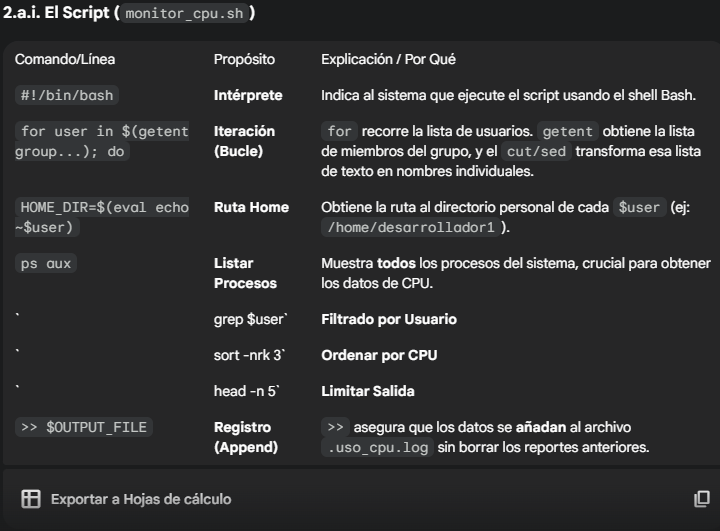

**1. 👥 Gestión de Usuarios y Grupos (Contraseñas)**

1.a) Consigna: Cuentas expiran al 31 de Julio
Comando a Usar: `sudo chage -E 2026-07-31 <usuario>`
Explicación / Por Qué: `chage` (Change Age) permite modificar los parámetros de caducidad. -E (Expire) establece la fecha en que la cuenta dejará de ser válida. Ejecuta esto para cada usuario.

1.b) Consigna: Desarrolladores deben cambiar contraseña cada 60 días.
comando a Usar : `sudo chage -M 60 <desarrollador>`
explicacion/por que: `-M` (Maximum) establece el número máximo de días que una contraseña puede permanecer sin ser cambiada (60 días).

1.c) Consigna: Administradores deben cambiar contraseña cada 30 días.
Comando a Usar:	`sudo chage -M 30 <administrador>`	 
Explicación / Por Qué Mismo principio que el anterior, pero con un plazo más corto (30 días) por seguridad.

1.d) Consigna: Crear técnicos sin directorio home.
Comando a usar: `sudo useradd -M <técnico>`
Explicación / Por Qué: `useradd` crea un nuevo usuario. -M (No Home) indica explícitamente al sistema que no cree el directorio personal (/home/<técnico>). Se usa cuando las cuentas son solo para servicios o para acceso limitado.

**Gestión y Monitoreo de Procesos**
2.a) Consigna: Cada 2 días, guardar los 5 procesos que más CPU consumen de cada desarrollador en el archivo oculto .uso_cpu.log en su home.
Esta tarea requiere un Script y cron.

2.a.i. El Script (monitor_cpu.sh)

**Programación de Tareas (Cron y At)**

3a) consigna BackUp semanal ( Carpeta `documento`) con `cron` DOMINGO 2:00AM.

3.b) Consigna: Copia de seguridad de /opt  con `at` (dentro de un mes)

3.c) Consigna: bloquear acceso a Desarrolladores (Viernes 21:00 a Lunes 5:00).

---

